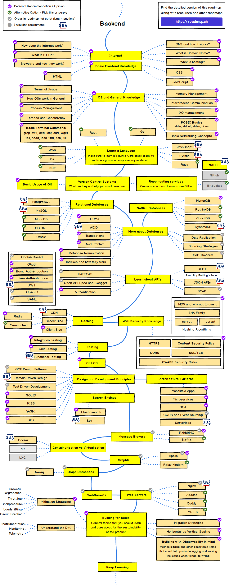

 # Backend Developer
A backend developer builds and maintains the technology that powers those components which, together, enable the user-facing side of the website or web application to even exist in the first place.  In order to make the server, application, and database communicate with each other, backend developers use server-side languages like PHP, Python, and NodeJS to build an application, and tools like MySQL and PostgreSQL to find, save, or change data and serve it back to the user in frontend code.

## Roadmap
The roadmap below is sourced from https://roadmap.sh/ and has been annotated with the SBA logo to identify focus areas for our backend developers.  It should be used as a map for learning the technologies we need to be successful inside our organization.

