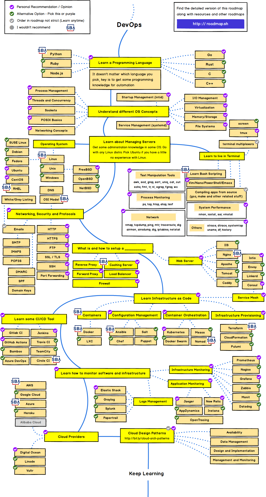

# DevOps Engineer
A DevOps engineer is an IT generalist who should have a wide-ranging knowledge of both development and operations, including coding, infrastructure management, system administration, and DevOps toolchains. DevOps engineers should also possess interpersonal skills since they work across company silos to create a more collaborative environment. 

DevOps engineers need to have a strong understanding of common system architecture, provisioning, and administration, but must also have experience with the traditional developer toolset and practices such as using source control, giving and receiving code reviews, writing unit tests, and familiarity with agile principles.

## Roadmap
The roadmap below is sourced from https://roadmap.sh/ and has been annotated with the SBA logo to identify focus areas for our devops engineers.  It should be used as a map for learning the technologies we need to be successful inside our organization.

 
