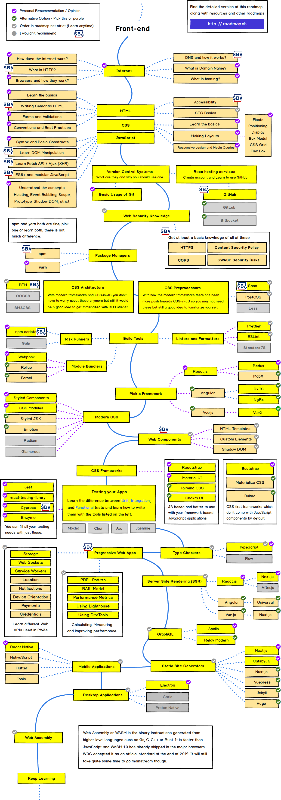

  # Frontend Developer
The frontend of a website is the part that users interact with. Everything that you see when you’re navigating around the Internet, from fonts and colors to dropdown menus and sliders, is a combo of HTML, CSS, and JavaScript being controlled by your computer’s browser.  Frontend developers are responsible for a website’s user-facing code and the architecture of its immersive user experiences. In order to execute those objectives, frontend developers must be adept at three main languages: HTML, CSS, and JavaScript programming.  In addition to fluency in these languages, frontend developers need to be familiar with semantic HTML, CSS approaches like ITCSS and CubeCSS, and modern JavaScript practices, which ensure great-looking content no matter the device.

## Roadmap
The roadmap below is sourced from https://roadmap.sh/ and has been annotated with the SBA logo to identify focus areas for our frontend developers.  It should be used as a map for learning the technologies we need to be successful inside our organization.

